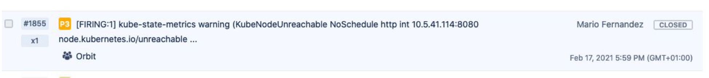

title: Humane On-Call: Alerting doesn't have to be painful
class: animation-fade
layout: true

<!-- This slide will serve as the base layout for all your slides -->

---

# Description (not part of the presentation)

Do you believe in “you build it, you run it”? What if you have on-call rotations, where you are responsible 24x7 for the health of a system? Nothing is quite so infuriating as a collection of poorly structured alerts that trigger randomly.

So, let’s do better! I want to talk about how to improve your monitoring capabilities. There are a few topics I want to touch:

- Reduce the noise
- Automate as much as possible
- Build actionable triggers
- Tune your monitoring constantly

After this talk, you’ll have concrete actions to make your engineers’ life easier when on-call

---

# Elevator Pitch (not part of the presentation)

A lot of companies want to be like Amazon today. DevOps, you build it you run it, and other practices are supposed to put you at the top of the technology pyramid.

On-Call is an increasing reality for developers, especially when  a site has strict uptime requirements. And sadly, the experience often sucks. It’s easy to mandate 24x7 support, it’s much harder to set it up in a way that doesn’t make the life of the people in the rotation miserable.

I want to talk about making that experience bearable. I’ve seen developers struggle with the operational burden over three companies already, and I think there are many actionable suggestions to improve it and build something sustainable.

---

class: impact full-width

.impact-wrapper[
# {{title}}
]

---

# Let's talk On-Call for a second

---

monitor production systems

---

24x7

---

You build it, you run it

---

# On-Call can suck

???

- if you have been part of a rotation you probably know what I mean

---

class: center middle

## Bad Night

.image-grid[

]

---

class: center middle

## Unhelpful Alerts

---

# Agenda

---

class: transition

## Mario Fernandez
 
### Staff Engineer
### Wayfair
 
---

# Enemies

noise
flakyness
acceptance

---

# Friends

Consistent
Comprehensive

---

class: center impact

# Noise

---

what is the source of noise in alerts?

---

accidental noise

---

warnings -> make them failures or ignore

---

alert k8s pod restarts

---

the solution: delete them!

---

# Acceptance

---

yeah that alert always triggers I ignore it

---

PM items ignored

---

# The Alert Pyramid

---

analog to the testing pyramid

---

- synthetic
- RUM
- APM
- Infrastructure

---

class: center impact

# Automation

---

automation is crucial in alerting

---

Benefits

- mainteinance
- spreading best practices
- granularity

---

any serious monitoring provider has APIs

---

terraform alert

---

Encoding best practices through automated alerts

---

# Tune Your Monitoring

---

adjust alerts

(based on the SRE handbook)

---

tuning has a dark side

---

I've been changing my mind about tuning

---

Constantly tuning monitors is treating the symptom, not the cause

---
