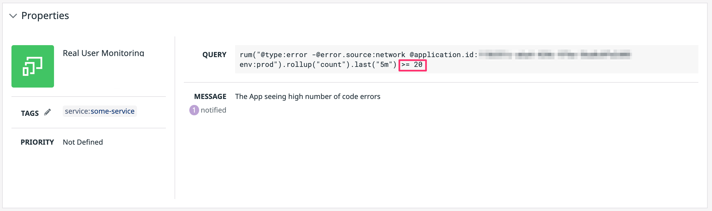
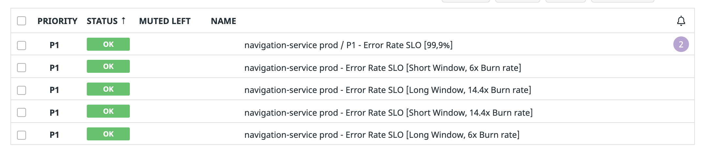

<!-- .slide: data-background-color="var(--r-main-color)"  -->

# Humane On-Call
## Alerting doesn't have to be painful

???

- this talk is about on-call
- more specifically, it's about alerting
- before I get started, how many of you are part of a regular on-call rotation?

---

<h2 class="fragment fade-up">
Bad alerting adds friction to operating production software
</h2>

<h2 class="fragment fade-up">
We can do better!
</h2>

???

- alerting, when done wrong, is a significant source of friction
- we can do better than that!
- That's the message of this talk. There are concrete actions we can take to fix common alerting issues 

---

<!-- .slide: data-background-color="var(--r-main-color)"  -->

# On-Call in a Nutshell

???

- I imagine most people here are familiar with on-call
- let me quickly talk about my understanding of it

---

## ✅ Being *available* to handle an incident
## ❌ Constantly monitor production

???

- It's not an active thing.
- It's reactive. You're available in case you're needed

---

## As part of a _rotation_


???

- Nobody should do on-call alone, although this happens sometimes, sadly
- weekly rotations, 24x7 or maybe only during business hours

---

<!-- .slide: data-background-color="var(--r-main-color)"  -->

# Why do this to ourselves?

???

- An immediate question is: Why should we do this to ourselves?

---

## Reason 1
### Users expect constant availability

???

- people expect to pull their phone and immediately get what they want from our application
- exception: presenting your taxes, at least in Spain

---

<!-- .slide: data-background-image="images/logos.png" data-background-size="100% auto" -->

???

- Maybe Facebook is not the best example right now, given the massive downtime they had

---

## Reason 2
### You build it, you run it

<span class="bottom-right"><a href="www.stevesmith.tech/blog/you-build-it-you-run-it/">stevesmith.tech/blog/you-build-it-you-run-it/</a></span>

???

- A second answer for "why do this to ourselves?"
- developers have "skin in the game"
- Build more resilient systems
- Less handovers, less overload for centralized operations team

---

<!-- .slide: data-background-color="var(--r-main-color)"  -->

# Alerting 101

???

- on-call is a big topic
- I'm going to focus on alerting

---

## Detect problems in production before your customers do

???

- alternatively, nobody wants to be the receiver of an escalation email coming from top management

---

## Monitoring ➕ Notification

???

- alerting is a combination of monitoring and notification
- observe systems (monitoring)
- detect anomalies based on certain criteria, and create a meaningful event to notify the appropriate operator (notification)

---

## The Four Golden Signals

### Latency
### Traffic
### Errors
### Saturation

<span class="bottom-right"><a href="https://sre.google/sre-book/monitoring-distributed-systems/">sre.google/sre-book/monitoring-distributed-systems/</a></span>

---

<!-- .slide: data-background-color="var(--r-main-color)"  -->

# ⚠️ 📟 🔥

???

- if you have been part of a rotation you probably know what I mean

---

## Constant Interruptions


???

- what if your alerts are ringing constantly
- can be extremely disruptive to your day-to-day work
- even more so if the person on-call keeps working on the regular topics

---

## Bad Night(s)


???

- alerts during working hours are actually the *good* case
- when the alerts start calling you at night is when life gets really miserable

---

<!-- .slide: data-background-image="images/flaky-alerts.png" data-background-size="auto 100%" -->

<h2 class="right">Flakiness</h2>

???

- this alert triggered and resolved within two minutes
- if you get waken up, it takes longer than that to get to a computer

---

<!-- .slide: data-background-image="images/explosion.jpeg" data-background-size="100% auto" -- >

???

- I could go on, but you get the point
- alerting _can_ suck

---

<!-- .slide: data-background-color="var(--r-main-color)"  -->

# Alerting Dysfunctions

???

- 18/78
- I've spent the past two years in full-time on-call, and have operated applications as a developer before that
- dysfunctions, plus ways to address them

---

### Mixed abstraction levels
### Lack of automation
### Noisy alerts
### Inadequate tools
### Mismatched tuning

---

<!-- .slide: data-background-color="var(--r-main-color)"  -->

# Mixed Abstraction Levels

---

## What are you monitoring?

<h3 class="fragment fade-up">
    <em>High-Level:</em> Close to the user
</h3>

<h3 class="fragment fade-up">
    <em>Low-Level:</em> Close to the infrastructure
</h3>

???

- alerts cover many different aspects
- There are some high level signals closer to the user
- There are low level signals closer to the infrastructure

---

<!-- .slide: data-background-image="images/monitoring-level.png" data-background-size="auto 100%" -->

???

- What if we consider the different sources of monitoring like we do the testing pyramid?

---

<!-- .slide: data-background-image="images/monitoring-pyramid.png" data-background-size="auto 100%" -->

???

- Simulating user traffic goes at the top -> synthetics
- We go do down progressively, like RUM or APM
- At the bottom, the monitoring of each individual piece
- They both visualize very different things about the state of a system

---

<!-- .slide: data-background-image="images/synthetic.png" data-background-size="100% auto" -->

???

- A synthetic is like an e2e test. It simulates the session of a user as they go through the application
- run regularly from different places
- Answer the question: Are the users able to fulfill core flows?

---

<!-- .slide: data-background-image="images/cpu-alert.png" data-background-size="auto 100%" -->

???

- An alert like CPU is high doesn't say anything about business impact
- However: If you need to know the health of something like a database, use a more targeted alert like this one


---

## Choose the alert based on what you want to monitor

???

- coming back to our situation, if you get paged you want to know about _user impact_

---

<!-- .slide: data-background-image="images/dashboard.png" data-background-size="100% auto" -->

???

- Dashboards are notorious for the overwhelming amount of data
- I really like to have a glance and answer the question: Are users being impacted?

---

## Learning 1️⃣
## ⬇️
### Use the right alert

---

<!-- .slide: data-background-color="var(--r-main-color)"  -->

# Lack of Automation

???

- 29/78
- people get used to do things by hand

---

## Manual work is not reproducible

???

- just think of the AWS documentation. To set up something it's a gigantic article with a thousand screenshots, when a snippet of code could do the same

---

## Automation is crucial in alerting

---

<!-- .slide: data-background-image="images/IaC.png" data-background-size="auto 100%" -->

???

- monitoring/alerting is infrastructure
- infrastructure is handled with code

---

<h2 class="fragment fade-up">
Reduce maintenance
</h2>

<h2 class="fragment fade-up">
Spread best practices
</h2>

---


<span class="bottom-right">https://registry.terraform.io/browse/providers</span>

---

```hcl
resource "datadog_monitor" "monitor" {
  count = try(var.enabled, false) == true ? 1 : 0

  name               = var.name
  type               = var.type
  query              = var.query
  message            = var.message

  monitor_thresholds {
    warning = lookup(var.monitor_thresholds, "warning", null)
    ok = lookup(var.monitor_thresholds, "ok", null)
    critical = lookup(var.monitor_thresholds, "critical", null)
  }

  priority            = var.priority
}
```

???

- This is simplified for space reasons, but you should get the idea

---

```hcl
resource "pagerduty_team" "team" {
  name = "Service Team"
}

resource "pagerduty_schedule" "schedule" {
  name      = "Weekly Engineering Rotation"
  time_zone = "Europe/Berlin"

  layer {
    name                         = "Night Shift"
    start                        = "2015-11-06T20:00:00-05:00"
    rotation_virtual_start       = "2015-11-06T20:00:00-05:00"
    rotation_turn_length_seconds = 86400
    users                        = [pagerduty_user.team.id]
  }

  teams = [pagerduty_team.example.id]
}
```

---

## What about more complex stuff?
### Multiwindow, Multi-Burn-Rate Alerts

---

<!-- .slide: data-background-image="images/multi-window.png" data-background-size="auto 100%" -->

???

- This is way too complex to do by hand
- Imagine scaling it up to hundreds of services

---

```hcl
module "error_rate_slo_burn_rate_long_window" {
  source  = "../../monitor"
  enabled = var.enabled

  name    = <<-EOT
  ${var.service_name} ${var.environment} - 
  Error Rate SLO [Long Window, ${var.burn_rate}x Burn rate]"
EOT

  query = <<-EOT
sum(${local.period}):(
  sum:trace.${local.metric}.request.errors{env:prod,service:${var.service_name}}
    .rollup(sum, ${var.window_in_seconds}) /
  sum:trace.${local.metric}.request.hits{env:prod,service:${var.service_name}}
    .rollup(sum, ${var.window_in_seconds})
) * 100 > ${local.threshold}
EOT

  monitor_thresholds = {
    critical = local.threshold
  }
}
```

---

```hcl
module "error_rate_slo_quick_burn" {
  source  = "../error_rate_slo_burn_rate"
  enabled = var.enabled

  service_name = var.service_name
  environment  = var.environment

  slo               = var.slo
  burn_rate         = 14.4
  window_in_seconds = 3600

  language = var.language
}
```

---

```hcl
module "error_rate_slo" {
  source  = "../../monitor"
  enabled = var.enabled

  name    = "${var.service_name} - Error Rate SLO [${var.slo}%]"
  type = "composite"

  query = <<-EOT
(module.error_rate_slo_quick_burn.long_window_id && 
    module.error_rate_slo_quick_burn.short_window_id)
||
(module.error_rate_slo_slow_burn.long_window_id && 
    module.error_rate_slo_slow_burn.short_window_id)
EOT

  message = templatefile("${path.module}/message.md", {
    service     = var.service_name
    environment = var.environment
    notify      = local.notify
  })
}
```

---

## Scale alerts inside a team

???

- If you want to monitor things deeply, you'll end up with a lot of alerts
- Carrying changes is impossible if you have to do it by hand

---

## Scale alerts across teams

???

- this is a problem in our organization right now
- a team learns from experience, but the learnings are rediscovered by other teams again

---

## Learning 2️⃣
## ⬇️
### Leverage automation at scale

???

- if there's one thing to take from this talk, it's this one

---

<!-- .slide: data-background-color="var(--r-main-color)"  -->

# Noisy Alerts

???

- 45/78

---

## When the signal is drowned by the noise

???

- picture a slack channel with a never-ending scrolling list of alerts

---

## Alert fatigue leads to ignored alerts

<span class="bottom-right"><a href="www.atlassian.com/incident-management/on-call/alert-fatigue">atlassian.com/incident-management/on-call/alert-fatigue</a></span>

???

- this is completely expected
- you can't constantly be in tension

---

## A lot of the noise is *accidental*

???

- Akin to the concept of accidental complexity
-- A certain amount of complexity is unavoidable
-- However, the wrong architecture can introduce avoidable complexity

---

<h2 class="right">Isn't this Kubernetes job?</h2>

<!-- .slide: data-background-image="images/low-pods-alert.png" data-background-size="auto 100%" -->

???

- alerts where action isn't clear.
- Kubernetes restarts pods all the time without intervention. It's kind of the point of using it
- If it's expected, why monitor it?

---

<h2 class="right">What should I do?</h2>

<!-- .slide: data-background-image="images/unclear-warning.png" data-background-size="100% auto" -->

???

- alerts where urgency isn't clear.

---

## Warnings are evil
### Make them failures or ignore them

???

- binary decisions (act/ignore) reduce noise

---

> When that alert wakes me up I just snooze it and keep sleeping

???

- This is an actual quote, I'm not making it up
-- Happened in a previous project that I joined as a Tech Lead
- we can not let it get to this

---

<!-- .slide: data-background-image="images/slowing-monolith.png" data-background-size="100% auto" -->

<h2 class="bottom-right">Long-lived issues</h2>

???

- notice the timeline. We're talking about months!

---

## Delete things you don't need!
### Like, seriously

---

## Learning 3️⃣
## ⬇️
### Reduce noise ruthlessly

???

- I feel like I'm pointing the obvious
- And yet, this is a pattern that keeps repeating wherever I go

---

<!-- .slide: data-background-color="var(--r-main-color)"  -->

# Inadequate Tools

???

- 56/78
- Good tooling has a clear place in alerting: Make your life easier

---

> Crappy tools are extra infuriating at 3 in the morning

???

- I'm going to quote myself for this one

---


---

## The market is full of high-quality tools

---


---


???

- Bottom line, use good tools. They're worth it
- I mention DD and PD here because I'm familiar with them. There are many alternatives

---

## Do you take good 🛠️ for granted?
### I've learned not to 😩

---

## Project at a German client 
### Ticketing system without features such as

???

- Counter example: A German client used an internal tool for incident management. It came straight out of the 90s

---

## Auto closing

<h2 class="fragment fade-up">
  Auto grouping
</h3>

<h2 class="fragment fade-up">
  Conditional routing
</h3>

<span class="fragment fade-up">
🤦
</span>

???

- if the alert gets opened and closed, it should be reflected in the tool and not add to the noise
- If the same alert or similar group of alerts get triggered, that should be clearly grouped and not treated as individual alerts
- Routing based on conditions
- 150 emails / incident, they might not even be needed anymore

---

## Learning 4️⃣
## ⬇️
### Adopt tools that support you

???

- people who enter rotations are making a commitment. They're owed the best tools possible

---

<!-- .slide: data-background-color="var(--r-main-color)"  -->

# Mismatched Tuning

???

- 66/78
- tuning alerts is tricky

---

## Minimize
### false _positives_
### false _negatives_

???

- these two objectives conflict with each other

---

## Use ratios for your metrics



???

- absolute number of errors doesn't really say anything

---

## Get enough data


???

- low traffic services are noisy
- solutions: aggregate services, create synthetic traffic

---

## Multiple small alerts



???

- say you want to measure big sudden spikes of errors, and also an elevated error rate over a longer period of time 
- one alert for both will inevitable be undertuned or oversensitive

---

## Reliable alerts are hard!

<span class="bottom-right"><a href="https://hceris.com/monitoring-alerts-that-dont-suck/">hceris.com/monitoring-alerts-that-dont-suck/</a></span>

???

- Keep in mind that there's a limit of what you can accomplish by tuning alerts
- In the end, alerts only reflect the underlying state of a system

---

## Learning 5️⃣
## ⬇️
### Tune alerts often

???

- still, getting alerts right is an iterative process

---

<!-- .slide: data-background-color="var(--r-main-color)"  -->

# Dysfunctions and Learnings Side by Side

???

- let's finish this by going over the dysfunctions again, and the actions to take

---

### Mixed abstraction levels
### Lack of automation
### Noisy alerts
### Inadequate tools
### Mismatched tuning

---

### Use the right alert
### Leverage automation at scale
### Reduce noise ruthlessly
### Adopt tools that support you
### Tune alerts often

???

- is there an order? I'd say depends on your situation

---

<!-- .slide: data-background-image="images/sre.png" data-background-size="100% auto" -->

???

- important area, but part of a bigger topic

---

<!-- .slide: data-background-color="var(--r-link-color-dark)"  -->

## Mario Fernandez
 
### Staff Engineer
### Wayfair

---
